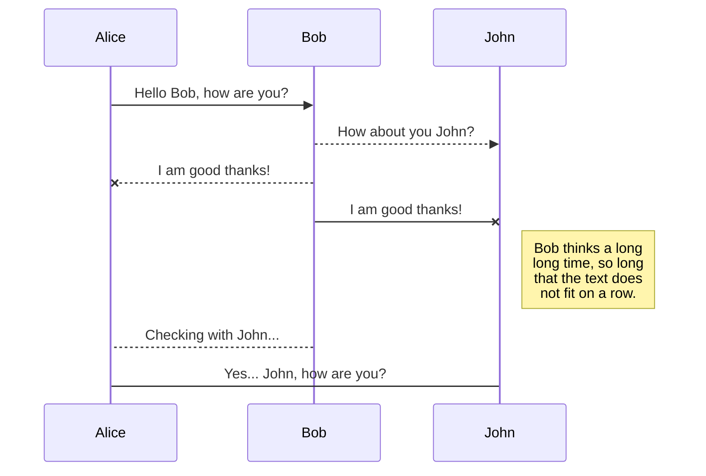
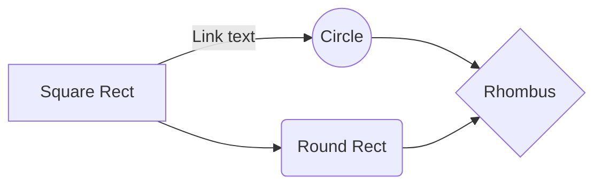

# Balanceo de carga web y almacenamiento centralizado

En el siguiente documento se encontrará la información necesaria para montar un sistema de alta disponibilidad web escalable. 
La demostración se ejecutará en un ambiente local generado con Oracle VirtualBox, pero a nivel configuración es replicable a otros virtualizadores de infraestructura o servidores físicos. 
En la generación de este laboratorio se utilizará Ubuntu 20.04.6 LTS.

		- Instancia Proxy 
		- Instancia Web-Server
		- Instancia Almacen 
		
Se utlizarán servicios de nginx como servidor proxy, apache2 como servidor web, y el protocolo sshfs para compartir archivos entre instancias. 
Se generará una primera plantilla con configuraciones básicas, que será luego replicada. 

# Configuración de red en Virtual Box 

		** Instancia Proxy** 
		
			- Adaptador de red 1: Adaptador puente 
			- Adaptador de red 2: Adaptador NAT
		
		** Instancia Web-Server**
		
			- Adaptador de red 1: Adaptador NAT
			- 
		** Instancia Almacen**
		
			- Adaptador de red 1: Adaptador NAT

## Configuración de plantilla 

Ingresar al servidor con usuario y contraseña generads en la instalación.

Necesitaremos para el acceso a las demás instancias, la configuración del servidor ssh. 

		sudo su 
		apt update && apt install -y ssh 
		   
Luego debemos crear llaves de acceso ssh y proveer de acceso ssh, debemos ingresar el siguiente comando aceptando todo, generará un par de llaves en el directorio por defecto /home/usuario/.ssh, en caso estemos como root en /root/.ssh

		ssh-keygen -t rsa

Considerando que las llaves generadas, nos servirán de acceso para las réplicas. Podremos generar el archivo de llaves autorizadas. 

		cat /root/.ssh/id_rsa.pub > /root/.ssh/authorized_keys

Descarga de archivos de configuración de red para los diferentes servidores. 

		SERVIDOR PROXY 
			curl https://pastebin.com/raw/utCtxz2w > /proxy.conf
			
		SERVIDOR WEB
			curl https://pastebin.com/raw/PsQW9LPh > /web.conf
			
		SERVIDOR ALMANCEN
			curl https://pastebin.com/raw/8AhXjjSt > /sshfs.conf

## Configuración del servidor proxy 

En esta etapa se generarán las conexiones para: 

1. Redirección de solicitudes de redes internas a internet
2. Redirección de solicitudes http desde internet al servidor web 

### Redirección de solicitudes de redes internas a internet

Considerando que es el único host con doble interfaz de red, y único con salida a internet deberá funcionar con nexo de las solicitudes a internet desde las instancias en la red interna. 

Configurar iptables para redireccionar solicitudes. 

	sudo sysctl net.ipv4.ip_forward=1
	sudo iptables -t nat -A POSTROUTING -o enp0s8 -j MASQUERADE

### Redirección de solicitudes http desde internet al servidor web

Necesitaremos instalar el software que utilizaremos para redireccionar el tráfico, mediante un proxy pass. 

		# apt update -y && apt install -y nginx 

Una vez instalado, necesitaremos configurar un VirtualHost que será el encargado de la redirección. 
En la siguiente configuración se puede ver que las consultas al puerto 80 http serán redirecciónadas a http://backend, configurado como la lista de las ips detalladas en upstream backend. En este caso, el servidor web corre en la ip "10.0.0.20" 

		# nano /etc/nginx/sites-available/balanceo
		upstream backend { 
			server 10.0.0.20;
		## <nombre><ip-del-servidor-web-interno>;	 
		} 
		server { 
				listen 80; 
				server_name istea.laboratorio; 
		##      server_name <direccion_web>
				location / { 
					proxy_set_header Host $host; 
					proxy_set_header X-Real-IP $remote_addr; 
					proxy_pass http://backend; 
				} 
		}

## Configuración del servidor de almacenamiento 

Se necesitará: 
1. Creación de un nuevo medio virtual 
2. Configuración de la red 
3. Configuración de nombre de host
4. Creación de partición
5. Configuración del sistema de archivos
6. Montaje de la unidad 
7. Configuración del directorio compartido, con usuario y permisos 
8. Configuración de la unidad para el montaje automático 

### 1. Creación de un nuevo medio virtual 

Para configurar el servidor en cuestión en VirtualBox se deberá generar un volumen nuevo que será el almacenamiento compartido por los servidores web, en dónde estará el sitió. 

Se debe generar un nuevo medio virtual

	Archivo/Herramientas/Administrador de medios virtuales/

Luego deberán seleccionar

	Crear/VDI/Seleccionar tamaño y ubicación/Terminar 

Luego deberán ingresar a la configuración de la instancia 

	Almacenamiento/Controlador SATA/Añadir unidad de disco/ seleccionar unidad creada

### 2. Configuración de la red 

Ingreso al sistema con usuario y contraseña generados en la instalación del a imagen. 

Copiar archivo de configuración de red para el sevidor de almacenamiento. 

		$ sudo su 
		# cp /sshfs.conf /etc/netplan/00-installer-config.yaml
Aplicar configuración de red 

		# netplan apply
Prueba de conectividad 

	# ping 8.8.8.8
	PING 8.8.8.8 (8.8.8.8) 56(84) bytes of data. 
	64 bytes from 8.8.8.8: icmp_seq=1 ttl=115 time=14.5 ms 
	64 bytes from 8.8.8.8: icmp_seq=2 ttl=115 time=16.4 ms 
	64 bytes from 8.8.8.8: icmp_seq=3 ttl=115 time=11.1 ms

En caso como en la captura tengamos respuesta, significa que se aplicó correctamente el archivo de configuración, y hay salida a internet, mediante el servidor proxy. 

### 3. Configuración de nombre de host 

	hostnamectl set-hostname sshfs-server

### 4. Creación de partición

Verificamos los dispositivos conectados. 

		root@sshfs-server:~# lsblk 
		
		NAME   MAJ:MIN RM  SIZE RO TYPE MOUNTPOINT 
		loop0    7:0    0 91,9M  1 loop /snap/lxd/24061 
		loop1    7:1    0 49,9M  1 loop /snap/snapd/18357 
		loop2    7:2    0 63,3M  1 loop /snap/core20/1828 
		loop3    7:3    0 63,5M  1 loop /snap/core20/2015 
		sda      8:0    0   25G  0 disk 
		├─sda1   8:1    0    1M  0 part 
		└─sda2   8:2    0   25G  0 part / 
		sdb      8:16   0    4G  0 disk 
		└─sdb1   8:17   0    4G  0 part /opt 
		sdc      8:32   0    2G  0 disk 
		sr0     11:0    1 1024M  0 rom
En este caso, crearemos la partición en el volumen sdc 

		fdisk /dev/sdc
		
		root@sshfs-server:~# fdisk /dev/sdc 
		
		Welcome to fdisk (util-linux 2.34).  
		Changes will remain in memory only, until you decide to write them. 
		Be careful before using the write command. 
		Device does not contain a recognized partition table. 
		Created a new DOS disklabel with disk identifier 0x5c0c924e. 

Creamos una nueva tabla de particiones vacía DOS 

	Command (m for help): o
	Created a new DOS disklabel with disk identifier 0x066099e5. 

Agregamos una nueva partición primaria número 1, iniciado con el sector 2048 y terminando con el último sector disponible del dispositivo.

	Command (m for help): n 
	Partition type 
	p   primary (0 primary, 0 extended, 4 free) 
	e   extended (container for logical partitions) 

	Select (default p): p 
	Partition number (1-4, default 1): 1 
	First sector (2048-4194303, default 2048): 
	Last sector, +/-sectors or +/-size{K,M,G,T,P} (2048-4194303, default 4194303): 
	
	Created a new partition 1 of type 'Linux' and of size 2 GiB. 

Guardamos y salimos
	
	Command (m for help): w
	The partition table has been altered. 
	Calling ioctl() to re-read partition table. 
	Syncing disks.

### 5. Configuración del sistema de archivos 

		
		

## Export a file

You can export the current file by clicking **Export to disk** in the menu. You can choose to export the file as plain Markdown, as HTML using a Handlebars template or as a PDF.

# Synchronization

Synchronization is one of the biggest features of StackEdit. It enables you to synchronize any file in your workspace with other files stored in your **Google Drive**, your **Dropbox** and your **GitHub** accounts. This allows you to keep writing on other devices, collaborate with people you share the file with, integrate easily into your workflow... The synchronization mechanism takes place every minute in the background, downloading, merging, and uploading file modifications.

There are two types of synchronization and they can complement each other:

- The workspace synchronization will sync all your files, folders and settings automatically. This will allow you to fetch your workspace on any other device.
	> To start syncing your workspace, just sign in with Google in the menu.

- The file synchronization will keep one file of the workspace synced with one or multiple files in **Google Drive**, **Dropbox** or **GitHub**.
	> Before starting to sync files, you must link an account in the **Synchronize** sub-menu.

## Open a file

You can open a file from **Google Drive**, **Dropbox** or **GitHub** by opening the **Synchronize** sub-menu and clicking **Open from**. Once opened in the workspace, any modification in the file will be automatically synced.

## Save a file

You can save any file of the workspace to **Google Drive**, **Dropbox** or **GitHub** by opening the **Synchronize** sub-menu and clicking **Save on**. Even if a file in the workspace is already synced, you can save it to another location. StackEdit can sync one file with multiple locations and accounts.

## Synchronize a file

Once your file is linked to a synchronized location, StackEdit will periodically synchronize it by downloading/uploading any modification. A merge will be performed if necessary and conflicts will be resolved.

If you just have modified your file and you want to force syncing, click the **Synchronize now** button in the navigation bar.

> **Note:** The **Synchronize now** button is disabled if you have no file to synchronize.

## Manage file synchronization

Since one file can be synced with multiple locations, you can list and manage synchronized locations by clicking **File synchronization** in the **Synchronize** sub-menu. This allows you to list and remove synchronized locations that are linked to your file.

# Publication

Publishing in StackEdit makes it simple for you to publish online your files. Once you're happy with a file, you can publish it to different hosting platforms like **Blogger**, **Dropbox**, **Gist**, **GitHub**, **Google Drive**, **WordPress** and **Zendesk**. With [Handlebars templates](http://handlebarsjs.com/), you have full control over what you export.

> Before starting to publish, you must link an account in the **Publish** sub-menu.

## Publish a File

You can publish your file by opening the **Publish** sub-menu and by clicking **Publish to**. For some locations, you can choose between the following formats:

- Markdown: publish the Markdown text on a website that can interpret it (**GitHub** for instance),
- HTML: publish the file converted to HTML via a Handlebars template (on a blog for example).

## Update a publication

After publishing, StackEdit keeps your file linked to that publication which makes it easy for you to re-publish it. Once you have modified your file and you want to update your publication, click on the **Publish now** button in the navigation bar.

> **Note:** The **Publish now** button is disabled if your file has not been published yet.

## Manage file publication

Since one file can be published to multiple locations, you can list and manage publish locations by clicking **File publication** in the **Publish** sub-menu. This allows you to list and remove publication locations that are linked to your file.

# Markdown extensions

StackEdit extends the standard Markdown syntax by adding extra **Markdown extensions**, providing you with some nice features.

> **ProTip:** You can disable any **Markdown extension** in the **File properties** dialog.

## SmartyPants

SmartyPants converts ASCII punctuation characters into "smart" typographic punctuation HTML entities. For example:

|                |ASCII                          |HTML                         |
|----------------|-------------------------------|-----------------------------|
|Single backticks|`'Isn't this fun?'`            |'Isn't this fun?'            |
|Quotes          |`"Isn't this fun?"`            |"Isn't this fun?"            |
|Dashes          |`-- is en-dash, --- is em-dash`|-- is en-dash, --- is em-dash|

## KaTeX

You can render LaTeX mathematical expressions using [KaTeX](https://khan.github.io/KaTeX/):

The *Gamma function* satisfying $\Gamma(n) = (n-1)!\quad\forall n\in\mathbb N$ is via the Euler integral

$$
\Gamma(z) = \int_0^\infty t^{z-1}e^{-t}dt\,.
$$

> You can find more information about **LaTeX** mathematical expressions [here](http://meta.math.stackexchange.com/questions/5020/mathjax-basic-tutorial-and-quick-reference).

## UML diagrams

You can render UML diagrams using [Mermaid](https://mermaidjs.github.io/). For example, this will produce a sequence diagram:

And this will produce a flow chart:

<!--stackedit_data:
eyJoaXN0b3J5IjpbLTIwNDE1MDk2MDUsMTk0NTI0NDk2Myw5Nj
EyNjc1NDhdfQ==
-->